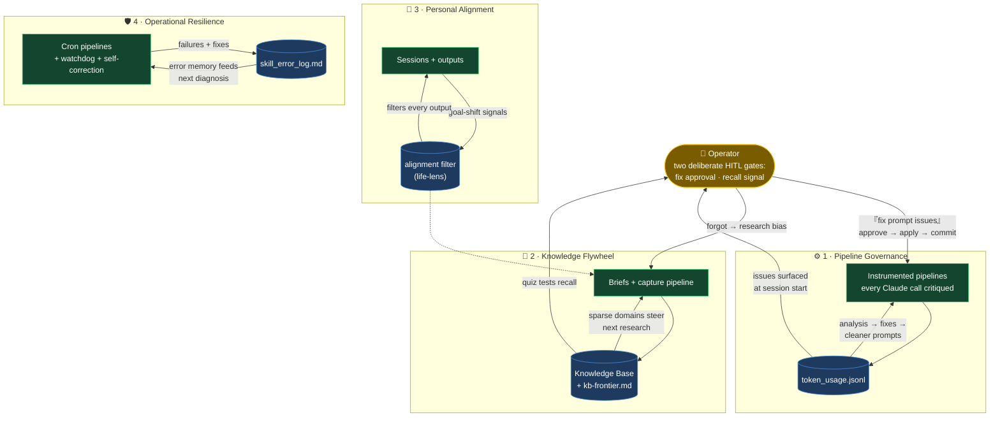
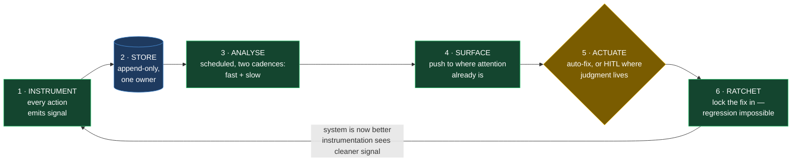
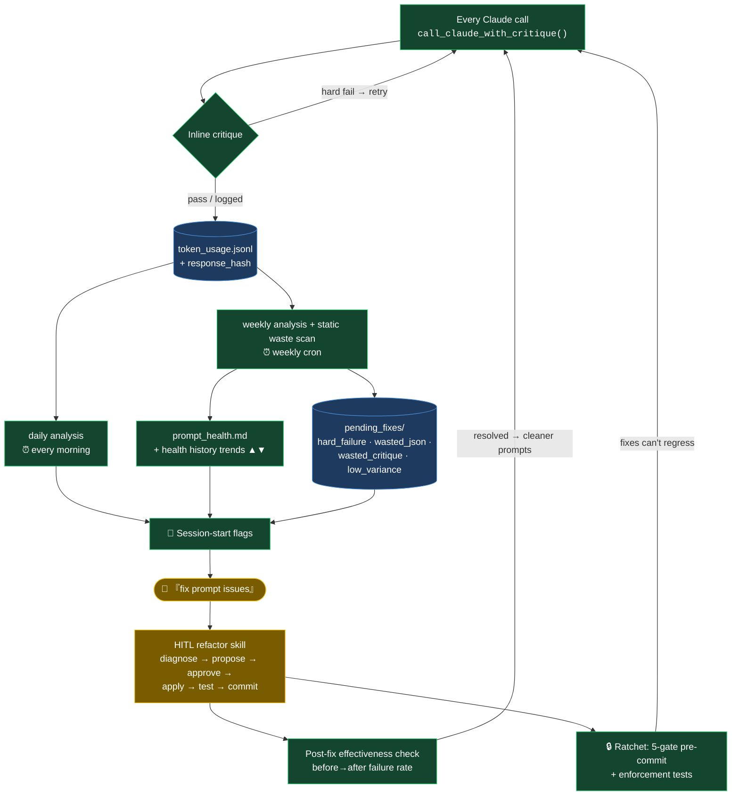
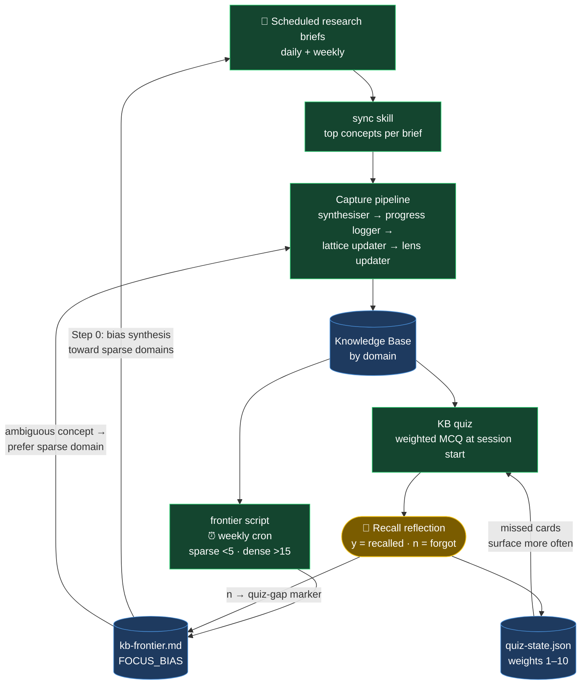
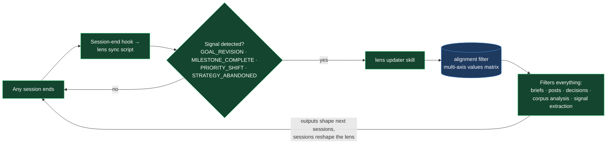
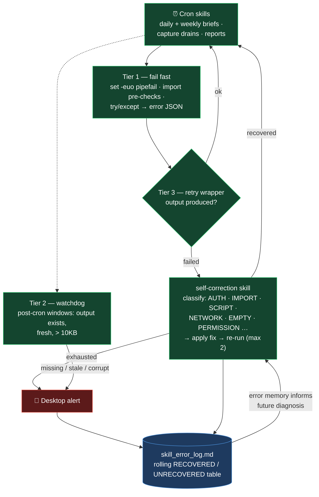

# 🔄 Feedback Loops — How a Second Brain Improves Itself

> Every pipeline in this system generates signal. Signal drives fixes. Fixes reduce waste.
> Freed capacity compounds into better outputs. This document maps **every reinforcing loop**
> wired into the architecture — automatic and human-in-the-loop (HITL) — and extracts the
> **reusable six-stage pattern** behind all of them, so any new system can be architected to
> improve with every passing day rather than decay from the moment it ships.

**Legend used in all diagrams:**
🟢 fully automatic · 🟡 HITL gate (human approves or supplies the signal) · 🗄️ shared state store

---

## The System at a Glance

Four loop families orbit two shared assets — the **monitor log** and the **Knowledge Base** —
with the human operator sitting at exactly two deliberate HITL gates.

---

## The Reusable Pattern — Anatomy of a Self-Improving System

Strip away the specifics and every loop in this system is the same six-stage machine.
This is the template: architect any new pipeline through these stages and it improves
with usage instead of decaying.

How each loop family instantiates the six stages:

| Stage | ⚙️ Governance | 🧠 Knowledge | 🧭 Alignment | 🛡️ Resilience |
|-------|--------------|--------------|--------------|----------------|
| **Instrument** | Critique fn on every Claude call | Briefs + quiz answers | Session-end transcript scan | `set -euo pipefail` + output checks |
| **Store** | `token_usage.jsonl` | KB + `quiz-state.json` | Lens sync log | `skill_error_log.md` |
| **Analyse** | Daily + weekly critique analysis | Frontier script sparse/dense scan | 4-signal detector | Watchdog post-cron windows |
| **Surface** | Session-start flags | Focus-bias file read at Step 0 | (direct — no human needed) | Desktop alert |
| **Actuate** | 🟡 HITL refactor skill | 🟢 Brief synthesis bias | 🟢 Lens auto-update | 🟢 Self-correction retry |
| **Ratchet** | Pre-commit gates + post-fix check | Spaced-repetition weights | In-context update rule | Error memory feeds next diagnosis |

Two architectural decisions do most of the work:

- **Two cadences per loop** — a fast loop (per-call retry, daily analysis) catches damage early;
  a slow loop (weekly analysis, weekly frontier scan) finds patterns no single event reveals.
- **The ratchet stage is what separates self-improving from self-healing.** Self-healing systems
  fix the same fault forever; a ratchet (enforcement tests, weight tables, error memory) makes
  each fix permanent, so effort compounds instead of repeating.

---

## Loop Index

| # | Loop | Signal | Actuator | Cadence | Mode |
|---|------|--------|----------|---------|------|
| 1 | Critique-retry micro-loop | Critique fn on every response | Retry inside `call_claude_with_critique()` | Per call | 🟢 Auto |
| 2 | Prompt health macro-loop | `token_usage.jsonl` failure patterns | HITL prompt-refactor skill | Daily + weekly cron → session start | 🟡 HITL fix |
| 3 | Waste detection | Response-hash variance · waste taxonomy · static scan | `pending_fixes/` queue → HITL | Weekly cron | 🟡 HITL fix |
| 4 | Enforcement ratchet | 5-gate pre-commit + enforcement tests | Blocked commits | Every commit | 🟢 Auto |
| 5 | Brief → KB | Completed brief PDFs | Sync skill → capture pipeline | After each brief | 🟢 Auto |
| 6 | KB → brief bias | Sparse/dense KB domains | Focus-bias file (`kb-frontier.md`) | Weekly cron | 🟢 Auto |
| 7 | Quiz → research bias | "n = didn't remember" reflection | Quiz-gap marker in focus-bias file | Per quiz | 🟡 Human signal |
| 8 | Quiz spaced repetition | Per-concept weight table | Question sampling weights | Per quiz | 🟢 Auto |
| 9 | Session → alignment filter | Goal-shift signals in transcript | Session-end hook → lens update | Every session end | 🟢 Auto |
| 10 | Self-correction retry | Failed cron skill output | Retry wrapper + self-correction skill | Per failure, max 2 retries | 🟢 Auto |
| 11 | Watchdog → error memory | Missing/undersized output PDFs | Desktop alert + `skill_error_log.md` | Post-cron windows | 🟢 Auto detect |
| 12 | Session-start surfacing | All queues + flags + handoff | Session-start context file → flags | First message of day | 🟢 Auto |

---

## ⚙️ Family 1 — Pipeline Governance (the self-governing AI ops loop)

The flagship loop. Every Claude call is instrumented; failure patterns are analysed on two
cadences; issues queue as typed fixes; the human approves; the fix is verified and locked in
by a pre-commit ratchet so it can never regress.

**Why it compounds:** cleaner prompts → lower failure rate → cleaner log data → more accurate
issue detection → better fix proposals. Proven in production: one parsing step's hard-failure
rate went **89% → ~0%** through a single cycle of this loop.

**HITL is deliberate.** The compounding happens in the *quality of proposals*, not the removal
of human judgment — the approval gate is the design, not a limitation.

Full component-level architecture: [`monitor/README.md`](../monitor/README.md).

---

## 🧠 Family 2 — Knowledge Flywheel

Briefs feed the KB; KB gaps steer the briefs; quiz forgetting events redirect future research
toward exactly the topics slipping away. Knowledge that fades gets automatically re-fed.

**The elegant bit (loop 7):** forgetting a concept in a quiz appends a `(quiz gap)` marker to
the focus-bias line — the next brief automatically researches that domain, and re-exposure
through content reinforces recall. The system *teaches back* what you forget.

---

## 🧭 Family 3 — Personal Alignment

A personal values/goals filter (the "lens") shapes every brief, post, and decision — and the
system keeps the lens itself current without being asked.

Also wired in-context: a global-instructions rule updates the lens **mid-conversation** the
moment a revised goal, abandoned strategy, or milestone is stated — the filter reflects the
current person, never a months-old snapshot. The capture pipeline (Family 2) feeds the lens
too, via the lens updater on every KB entry.

---

## 🛡️ Family 4 — Operational Resilience

Three tiers ensure cron pipelines fail loudly, fix themselves, and *remember* their failures.

The closing edge matters: every failure and fix is appended to `skill_error_log.md`, so the
self-correction skill diagnoses each new failure with the memory of every previous one.

---

## 🔔 The Surfacing Layer — where loops meet the human

No loop is useful if its output is never seen. A single background hook (once per day)
aggregates every queue into a session-start context file, and the first message of each
session surfaces:

| Flag | Feeding loop |
|------|--------------|
| ↩ Last session handoff (worked on / pending) | Session continuity |
| ⚠ New input files detected for ingestion pipelines | Delta processing |
| 📋 Idea backlog count | Idea capture |
| 🔧 Prompt health issues (weekly + daily new) | Family 1 |
| 📋 Pending prompt fixes queued | Family 1 |
| ⚠ Stale health report (cron failed?) | Family 1 — the loop monitors *itself* |

---

## Design Principles

1. **Compounding over sprinting** — each improvement makes the next one cheaper: cleaner data → better detection → better proposals → cleaner data.
2. **HITL exactly where judgment lives** — fix approval and recall reflection. Everything else is automatic. The human gates are the two places a wrong automatic decision would compound the wrong way.
3. **Detection is auto, repair is verified** — fixes ship only after a post-fix before→after check, then a pre-commit ratchet stops regression.
4. **Loops monitor the loops** — stale-report detection catches a dead analysis cron; the watchdog catches dead pipelines; tests catch pattern drift.
5. **Single source of truth** — each store (`token_usage.jsonl`, KB, `kb-frontier.md`, `skill_error_log.md`, the lens) is owned by one writer; everything else references it.

---

*Related: [monitor architecture](../monitor/README.md) · [extending the loops](../EXTENDING.md) · [main README](../README.md).*
