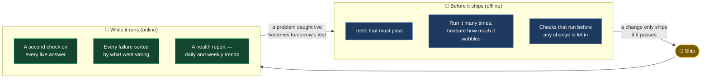
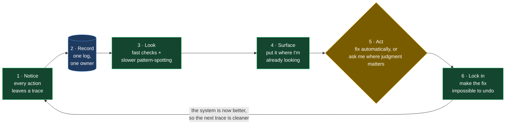

# Feedback Loops — how I keep an AI system improving after it ships

Most AI systems are at their best the day they ship, and get worse from there. Prompts drift.
An edge case starts failing and nobody notices until someone complains. The same fault gets
patched three times because the fix never really stuck.

I wanted the opposite: a system that gets *better* the more it runs. This is how I built that —
and the honest version is that I only understood the pattern after patching one parsing fault
three separate times before it occurred to me to make the fix permanent.

**Who this is for:** people building or hiring for AI product work who know that shipping the
model is the easy part, and the hard part is the evaluation, monitoring and control that has to
keep running afterwards.

---

## The real problem

Take a concrete one. An AI step reads loan applications and pulls out the fields that matter.
It works on the day it goes live. Then a lender tweaks their document layout, extraction quality
slips, and for weeks the system is quietly getting things slightly wrong — until a human spot-check
catches it. The model didn't break. The *discipline around the model* was missing: nothing was
measuring quality on live traffic, and nothing made yesterday's fix impossible to undo.

That discipline — how you measure quality, how you catch things slipping, how you make an
improvement permanent — is the whole difference between an AI demo and an AI product.

---

## Two kinds of checking: before it ships, and while it runs

Good AI teams check their systems two ways. This one does both, built into the pipeline rather
than added on later.

- **Before it ships (offline checks):** a change is judged against what "good" looks like, run
  many times to see how consistent it is, and blocked automatically if it fails. This is the
  safety net that proves a fix works before anyone relies on it.
- **While it runs (online checks):** every live answer gets a second look, every failure is
  sorted by what actually went wrong, and a health report shows whether things are trending
  better or worse. This is the smoke alarm — it catches drift while it's still cheap to fix.

The two join up: a problem caught live becomes a new before-it-ships test. That's the mechanism
that makes the quality bar only ever go up. In enterprise language, this is *offline and online
evaluation* — the same thing a serious AI programme is expected to stand up.

---

## One pattern underneath everything

Once I'd built a few of these, they turned out to be the same machine wearing different clothes.
Every loop in the system runs the same six steps:

The step that matters most is the last one: **lock in**. Plenty of systems recover from a
failure — but if the fix isn't made permanent, the same fault comes back and you fix it again
forever. Locking each fix in behind a test means effort adds up instead of repeating. That one
choice is why the failure rate trends down over time instead of staying flat.

It worked in practice: one step was failing 89% of the time. Notice it, surface it, approve the
fix, lock it in behind a test — and it went to near zero, and hasn't come back.

---

## Where this lands in a bank

The words are different but the machinery is the same one a regulated AI programme has to build.
I'm not claiming compliance here — it's a personal system — just the same engineering done because
it's the right way to build.

| What a bank calls it | What it actually means | How this does it |
|---|---|---|
| **AI observability** | Know what every AI call did, and whether it worked | Every call traced → one running log → a health report |
| **Model / prompt governance** | Changes are reviewed and can't quietly regress | A human approves the fix; a check then makes it un-undoable |
| **Managing risk over the lifecycle** | Risk is handled continuously, not signed off once | Every change: add the safeguard, test it, ship, watch, adjust |
| **Operational resilience** | Assume things break; notice and recover fast | A watchdog, an auto-retry, and a memory of past failures |
| **Human oversight** | A person can review and stop things | Two deliberate points where I approve before it proceeds |

For AI product work, this is a straight answer to "how do you govern AI once it's live?" — not a
policy slide, but a system that's actually running, with a timestamped record of every decision.

---

## The full technical map

Under the hood this is **12 reinforcing loops across four families** — pipeline governance, a
knowledge flywheel, personal alignment, and operational resilience — each a version of the six
steps above, each with its own fast and slow rhythm.

The complete map — diagrams for every loop, which ones run on their own versus which ask a human,
who owns each log, and a reusable template for building your own — is here:

**[→ The full feedback-loops architecture](../FEEDBACK_LOOPS.md)**

Related: **[the monitor that watches every call →](../../monitor/README.md)** · **[extending the loops →](../../EXTENDING.md)**
