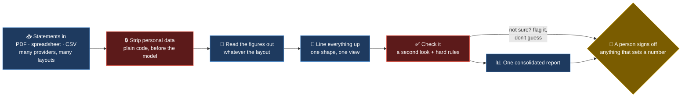

# Financial OS — one live picture from a drawer full of statements

My money lived in a dozen places, each with its own statement in its own layout. To see the whole
position I'd open each one, copy the figures into a master sheet, reconcile the totals — and by the
time I finished, it was already out of date. So I kept making decisions on a stale picture. I built
this to stop doing that by hand.

> *Statements go in — PDFs, spreadsheet exports, CSVs. A single consolidated position comes out.
> The personal data is stripped before any model sees it, and a person signs off anything that
> changes a number that decisions depend on.*

**Who this is for:** people working in financial services who'll recognise the shape of this
immediately — messy documents, a dozen formats, reconciliation, an audit trail. It's the same
problem a bank spends heavily on, just at kitchen-table scale.

---

## The problem

Anyone with more than a couple of accounts hits the same wall. The numbers are scattered, in
formats that don't agree, and pulling them together is slow and easy to get wrong. Because it's
tedious, it happens rarely — so the picture you decide on is always a little bit old.

The part that interested me is that this is a small copy of a big problem. Swap "my accounts" for
"counterparty statements" or "sub-ledger extracts" and it's exactly the document-ingestion-and-
reconciliation work financial institutions pour money into.

---

## What it does

Drop new statements in a watched folder and it runs itself: reads each document, pulls the figures
out whatever the layout, lines them all up into one shape, checks the result, and produces a single
report. What used to be an afternoon of copy-paste each week is now a job that just runs — hours
of manual work a week, gone.

---

## How it's built — and the one rule that matters

I built it to be boring where it has to be trusted, and clever only where judgment is actually
needed.

- **Personal data is stripped first, by plain code — not the model.** Anything sensitive is gone
  before a single figure reaches an AI. Because that step is plain code, it's predictable and I can
  test it. The model only ever sees de-identified numbers.
- **Reading the figures out doesn't depend on a fixed template.** Instead of a brittle parser per
  provider, the model reads the document and returns the fields — so a new provider or a changed
  layout doesn't break it.
- **Everything gets lined up to one shape.** Different providers name the same thing five ways; one
  agreed shape is the source of truth, so the final view compares like with like.
- **The one rule I'd put on a wall: flag, don't fabricate.** A second look judges each reading, and
  hard rules catch impossible values. Anything the system isn't sure about gets flagged for me — it
  never quietly guesses. When the output is money, that's the rule that matters most.
- **A person signs off anything that sets a number decisions rely on.** The report writes itself;
  committing a figure others depend on waits for a human yes.

Every AI call in the pipeline is watched and double-checked, so if a reading step starts to drift,
the [feedback loops](./FEEDBACK_LOOPS.md) catch it and it gets fixed once, for good.

---

## Why the pattern travels

| In this personal build | The bank's version of the same thing |
|---|---|
| Statements from many providers, many layouts | Counterparty and sub-ledger extracts from many systems |
| Model reads the figures instead of a parser per provider | Document ingestion that survives format changes |
| Line everything up to one shape | A canonical data model, one golden source |
| Strip personal data before the model | Data governance — de-identify before you process |
| Flag when unsure, never guess | Controls on generated figures — accuracy and robustness |
| A person signs off any number that's set | Maker-checker on anything that touches the record |

The reason this sits on a profile and not just in a private folder: the domain happens to be
personal finance, but the engineering is the same one banks are trying to buy.

---

**[← Back to the main README](../../README.md)** · **[How the feedback loops work →](./FEEDBACK_LOOPS.md)**
