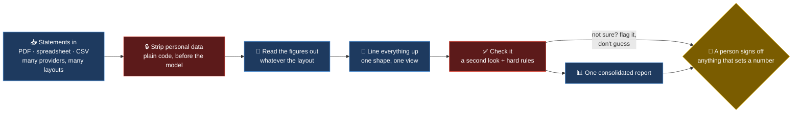

# Financial OS — what it takes to make AI trustworthy with money

Every bank is trying to buy roughly the same thing: a pipeline that reads messy documents from a
dozen source systems, survives their format changes, and produces figures people can act on. The
*functional* version of that is easy - a model reads a document and returns numbers. The
*trustworthy* version is the much larger job. I built a small version over my own
financial statements to show I understand the difference.

The honest reason it exists: my money lived in a dozen places, each with its own statement
layout, and by the time I'd added it up by hand it was already out of date, so I kept deciding on
a stale picture. The useful part wasn't the admin; it was noticing this is the same problem a
bank has - swap "my accounts" for "counterparty statements" or "sub-ledger extracts" and it's the
document-ingestion-and-reconciliation work financial institutions spend heavily on.

> *Statements go in — PDFs, spreadsheet exports, CSVs. One consolidated position comes out. The
> personal data is stripped before any model sees it, and a human signs off anything that sets a
> number others rely on.*

---

## The strategic frame: trustworthiness comes from controls, not a better model

A functional pipeline and a trustworthy one can produce the same number on a good day. The
difference shows on a bad one - a changed layout, an ambiguous figure, a value that's subtly
wrong. Trustworthiness comes from deliberate controls around an ordinary model, and those
controls are the actual work.

---

## Zoom in: the controls, and the one rule that governs them

I built it to be predictable where it has to be trusted, and to use judgment only where judgment
is actually needed.

- **Personal data is stripped first, by plain code — not the model.** Anything sensitive is gone
  before a single figure reaches an AI. Because that step is plain code it's predictable and
  testable; the model only ever sees de-identified numbers. That's data governance done before
  processing, not after — the same order a bank has to do it in.
- **Reading the figures out doesn't depend on a fixed template.** Instead of a brittle parser per
  provider, the model reads the document and returns the fields — so a new provider or a changed
  layout doesn't break it. Resilience to format drift is much of why enterprises want this.
- **Everything is lined up to one shape.** Different providers name the same thing five ways; one
  agreed shape is the source of truth, so the final view compares like with like. That's a
  canonical data model, in miniature.
- **The core rule: flag, don't fabricate.** A second look judges each reading, hard
  rules catch impossible values, and anything the system isn't sure about is flagged for a human —
  it never quietly guesses. When the output is money, that is the rule that matters most, and it's
  the maker-checker discipline every ledger already runs on.
- **A person signs off any number others will rely on.** The report writes itself; committing a
  figure that downstream decisions depend on waits for a human yes.

Every AI call in the pipeline is watched and double-checked, so if a reading step starts to drift,
the [feedback loops](./FEEDBACK_LOOPS.md) catch it and it gets fixed once, for good.

---

## Why the pattern travels

| In this personal build | The bank's version of the same thing |
|---|---|
| Statements from many providers, many layouts | Counterparty and sub-ledger extracts from many systems |
| Model reads the figures instead of a parser per provider | Document ingestion that survives format changes |
| Line everything up to one shape | A canonical data model, one golden source |
| Strip personal data before the model | Data governance — de-identify before you process |
| Flag when unsure, never guess | Controls on generated figures — accuracy and robustness |
| A person signs off any number that's set | Maker-checker on anything that touches the record |

That column on the right is why this sits on a profile and not just in a private folder. The
domain is personal finance, but the engineering and the judgment behind a trustworthy figure are
the part that transfers to a bank.

---

**[← Back to the main README](../../README.md)** · **[How the feedback loops work →](./FEEDBACK_LOOPS.md)**
