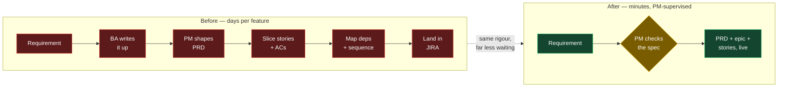
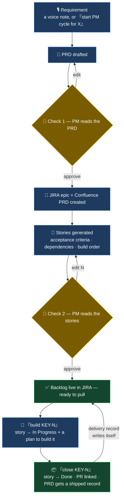

# JIRA PM Factory — from a stakeholder conversation to a ready backlog, the same day

On the programmes I've run, the backlog was often the bottleneck — and the bottleneck was me.

Turning a conversation into something a team can build — a spec, stories, acceptance criteria,
dependencies, a sensible order — is days of skilled work per feature. It's also the work you
can't safely rush. So it stacks up on whoever's most senior. I built this to take that work off
the critical path without dropping the standard.

> *A requirement goes in; a Confluence PRD, a JIRA epic, and dependency-mapped stories come
> out — with a person signing off at every gate.*

---

## The expensive wait is upstream of the build

Picture a real one. A large bank is remediating a collections process under a regulatory
deadline. The requirements are clear enough after a workshop. But before an engineer touches
anything, a BA writes it up, a PM shapes a PRD, someone slices it into stories, writes the
acceptance criteria, works out what blocks what, sequences it, and lands it all in JIRA.

That round trip is days of senior time per feature — and it repeats for every feature, every
sprint. It's also the part most sensitive to being rushed. Thin out the acceptance criteria and
the story bounces back from dev. Skip the dependency mapping and week two blocks on week one.
The cost of cutting a corner here shows up later, when it's most expensive to unwind.

This is the slowest, most repeated step in the whole chain — which is exactly why it's the
right thing to automate first.

---

## What changes

The rigour stays. Acceptance criteria, dependency links (blocks / is blocked by), and the build
order are all still produced. What changes is that a PM now *reviews and approves* that output
instead of *hand-typing* it. The practitioner moves from author to editor — the same senior
judgment, applied to far more work.

Worth being honest about what happened here: the bottleneck didn't disappear, it moved. It used
to be how fast a person could write a backlog. Now it's how fast they can read one. That's a much
better place for it to sit.

---

## The build cycle — three plain commands, two real checkpoints

The pipeline runs the full lifecycle. A person owns every step that changes a client's system;
nothing lands in JIRA on its own.

| Say this | It does this | Who's on the hook |
|---|---|---|
| `start PM cycle for X` | Drafts the PRD, opens the epic, writes the stories with acceptance criteria, dependencies and order | PM approves the PRD, then the stories |
| `build KEY-N` | Moves the story to In Progress, pulls the criteria and any review notes into a build plan | The engineer picks it up |
| `close KEY-N, PR: <url>` | Moves the story to Done, links the PR, adds a dated shipped note to the Confluence PRD | Nobody — the record writes itself |

A voice note can also start the cycle: it's transcribed on the machine, cleaned up into plain
requirements, sent to the right JIRA project by what it's *about* rather than its filename, and
held at an approval message before anything is created.

---

## What it changes in practice

- The scarcest thing on a programme is senior PM/BA time. The limit stops being how fast
  someone can write a backlog and becomes how fast they can check one.
- The control is part of the design, not bolted on afterwards. Two human checkpoints sit
  exactly where a wrong automated call would be costly — approving the spec, and approving the
  stories. Nothing reaches a client's system unread.
- The paper trail is automatic. Every feature carries a PRD, a linked epic, and a shipped
  record with the PR and the date — written as the work happens, not reconstructed later.
- It gets cheaper each time. The pipeline is shared infrastructure, so the second feature costs
  less than the first, and the tenth less again. The wait between "we agreed this" and "a team
  can pull it" drops from days to a supervised few minutes.

---

## The technical details

This page is the operating picture. For the full mechanics — the two ways a feature can enter,
exactly what each checkpoint controls, auto-close from a branch name, how routing decides the
project, and the known gaps — see the **[PM Pipeline Runbook →](../pm-pipeline-runbook.md)**.

Real features built this way, with their original PRDs, are in
**[Case Studies →](../case-studies/README.md)**.
