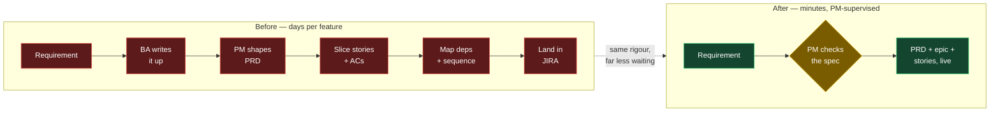
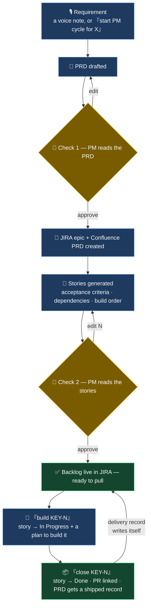

# JIRA PM Factory — where I put AI in the delivery chain, and where I keep a human

A view I've come to after fifteen years delivering in regulated banking, insurance and pensions:
the expensive delay in a programme is rarely the build. It's upstream - in the days of senior
judgment spent turning a conversation into a backlog a team can actually pull. That's the work I
put AI on: not the hardest work, but the slowest and most repeated, and the step that gates
everything after it.

I'd led AI-tooling adoption across delivery squads before I built this, so I wasn't guessing at
what automates cleanly. And I built this one end to end myself, for a reason I hold to: I don't
ask a team to adopt anything I haven't first run through my own hands.

> *A requirement goes in; a Confluence PRD, a JIRA epic, and dependency-mapped stories come
> out — with a person signing off at every gate.*

---

## The strategic call: automate the slow middle, keep the human at the edges

Picture a programme I'd recognise. A large bank is remediating a collections process under a
regulatory deadline. The requirements are clear enough after a workshop. But before an engineer
touches anything, a BA writes it up, a PM shapes a PRD, someone slices it into stories, writes the
acceptance criteria, works out what blocks what, sequences it, and lands it in JIRA.

That round trip is days of senior time per feature, and it repeats every sprint. It's also the
part most sensitive to being rushed — thin the acceptance criteria and the story bounces back from
dev; skip the dependency mapping and week two blocks on week one. The cost of a cut corner here
surfaces later, when it's most expensive to unwind.

So there are really two decisions, and the second matters more than the first: *put AI on the
slow middle* - the drafting, slicing, sequencing - and *keep a human on the two edges* where a
wrong call is expensive: agreeing the spec, and agreeing the stories. Deciding what to automate is
a productivity question; deciding what not to automate is a governance one.

---

## Zoom in: what actually changes

The rigour stays - acceptance criteria, dependency links, build order, all still produced. What
changes is that a senior person now *reviews and approves* that output instead of *hand-typing*
it. That's more than a workflow tweak - it shifts the senior constraint from authorship to review.
A backlog I've read and approved is one I can stand behind to a steering committee, and one a
regulator can audit. The bottleneck moved from how fast a person can write a backlog to how fast
they can judge one.

---

## The build cycle — three plain commands, two real checkpoints

| Say this | It does this | Who's on the hook |
|---|---|---|
| `start PM cycle for X` | Drafts the PRD, opens the epic, writes the stories with acceptance criteria, dependencies and order | PM approves the PRD, then the stories |
| `build KEY-N` | Moves the story to In Progress, pulls the criteria and any review notes into a build plan | The engineer picks it up |
| `close KEY-N, PR: <url>` | Moves the story to Done, links the PR, adds a dated shipped note to the Confluence PRD | Nobody — the record writes itself |

A voice note can also start the cycle: it's transcribed on the machine, cleaned into plain
requirements, routed to the right JIRA project by what it's *about* rather than its filename, and
held at an approval message before anything is created.

---

## What it changes for a delivery organisation

- Senior PM/BA judgment is the scarce resource on any programme. This stops it being spent on
  producing backlogs and puts it on deciding them.
- The control is the design, not a bolt-on. Two human checkpoints sit exactly where a wrong
  automated call would be costly — nothing reaches a client's system unread.
- The audit trail writes itself. Every feature carries a PRD, a linked epic, and a shipped
  record with the PR and date — the evidence a steering committee or a regulator asks for,
  captured as the work happens rather than reconstructed after it.
- It's a capability a team keeps, not a one-off. The pipeline is shared infrastructure, so the
  tenth feature is cheaper than the first — the marginal cost of good delivery keeps falling.

---

## How I'd run this on a client engagement

Wire it to the client's own JIRA and Confluence. Keep the two gates as the governance contract
with their delivery leadership. Then use it to change the PM/BA mix — from producing backlogs to
making decisions — which is the same shift I led when I took GitHub Copilot across the
data-engineering squads and standardising the requirements-to-code path cut build effort by
roughly a fifth.

The pipeline itself is a few weekends of work. The judgment about where AI belongs in a regulated
delivery chain, and where it must not, is the part that took fifteen years.

---

## The technical details

This page is the operating picture. For the full mechanics — the two ways a feature can enter,
exactly what each checkpoint controls, auto-close from a branch name, how routing decides the
project, and the known gaps — see the **[PM Pipeline Runbook →](../pm-pipeline-runbook.md)**.

Real features built this way, with their original PRDs, are in
**[Case Studies →](../case-studies/README.md)**.
