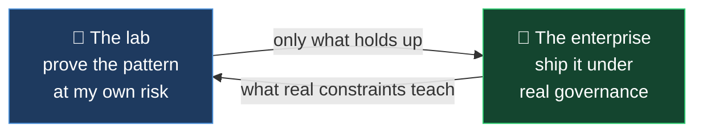

# The lab and the bank — one discipline, two proving grounds

The lab and the bank aren't two careers. They're one discipline on two proving grounds — and the
personal builds are the half most people misread.

---

## The lab

I prove agentic patterns on my own system first — the evaluation loops, the human gates, the
EU AI Act and DORA discipline — at my own risk, before any of it goes near a client. It's cheaper
to learn what doesn't hold up on my own work than on someone's regulated one. What survives is
what I bring.

---

## The bank

Each build is the lab version of a problem I've also delivered for real.

| The pattern | Proven in the lab | Delivered in the enterprise |
|---|---|---|
| Agentic workflow with human gates and an audit trail | **[JIRA PM Factory](./JIRA_PM_FACTORY.md)** | Led AI-tooling adoption across engineering squads — ~20% less build effort |
| Evaluation discipline and governed AI in production | **[Feedback Loops](./FEEDBACK_LOOPS.md)** | An ML solution signed off by Model Risk, under formal risk governance |
| Document extraction with controls, de-identify first | **[Financial OS](./FINANCIAL_OS.md)** | Prudential-compliant regulated data delivery across 12+ connected systems |

The lab keeps me current on what agentic systems can do. The enterprise keeps me honest about what
survives Model Risk on a collections remediation, a regulator on a pension merger, and the team
that has to maintain it on Monday.

---

## The method

Lab-proven, then governed. I don't bring enterprises patterns I've only read about — I bring ones
I've run at my own risk, then shipped under someone else's.

So the question I'd ask back is the one worth asking of anyone: when you buy "AI experience", are
you buying someone who's read the patterns, or someone who's already governed them?

**[← Back to the builds](../../README.md#three-builds-up-close)**
